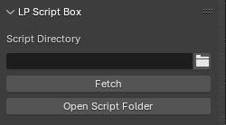

# LP Script Box
Manage, search, run, edit big collections of Blender python scripts with ease. Grow your script collection and script using habit without hassles.

<!--toc:start-->
- [Features](#features)
- [Usage](#usage)
  - [Configuration](#configuration)
  - [Buttons](#buttons)
  - [Pinned Scripts](#pinned-scripts)
  - [Quick Access](#quick-access)
    - [Quick Run](#quick-run)
    - [Pinned Scripts Pie Menu](#pinned-scripts-pie-menu)
- [Installation](#installation)
<!--toc:end-->

## Features
- Manage, list and filter scripts in folder
- Run Script without having to open text editor
- Quick open scripts to edit in Blender's text editor or external editor
- Fuzzy search for scripts to either run, edit or create new
- Pin scripts for quick access
- Pie menu for quick execution while using mouse
- All features are made hotkey-friendly and easy to add to quick favorites menu
## Usage
### Configuration
- Select the directory where you want to save/load your scripts.
You can set this either from LP Script Box panel (3D Viewport > Sidebar > LP Tools):

	

	Or from Addon Preferences:

	

- Set external editor's path in Preferences if you want to use "Edit with External Editor" feature.
For example: `nvim`, `subl`, `c:/vscode/code.exe`, etc.
### Buttons

- Edit: open Blender's internal text editor in a floating window to edit the selected script.
- Run: run the selected script. Execution context is the current 3D Viewport.
- Edit with External Editor: open the selected script in an external text editor (specified in addon preferences). This button is disabled when external editor path is not set.
- Open Script Folder: open the directory with OS's default file explorer.
### Pinned Scripts

Use the Pin Script button to pin the currently selected script to this panel. You can also use the Pin button next to each script item in the list.

Each pinned script will become a button which can be assigned hotkeys or added to Quick Favorites menu.

Pinned scripts can be reordered using the Up/Down arrow buttons. This is intended to adjust scripts' positions within the [Pinned Scripts Pie Menu](#pinned-scripts-pie-menu)
### Quick Access
#### Quick Run
This operator (button) is intended for use with a hotkey/quick favorites. 

Press the assigned hotkey and type to instantly find and run scripts with fuzzy-matching suggestions.

If a script with matching name doesn't exist in the script directory, open Blender's internal text editor to create a script with that name.

#### Pinned Scripts Pie Menu
This operator is intended for use with a hotkey.

Press the assigned hotkey to open a pie menu with the first 8 pinned scripts. This allows quick execution while using mouse.

## Installation
Install the addon like you would install any legacy addon with a zip file.
Should be compatible with all version of Blender since 3.6.
Tested in Blender 3.6-4.4.

Edit > Preferences > Addons > Install from Disk > Select the zip file > Done

